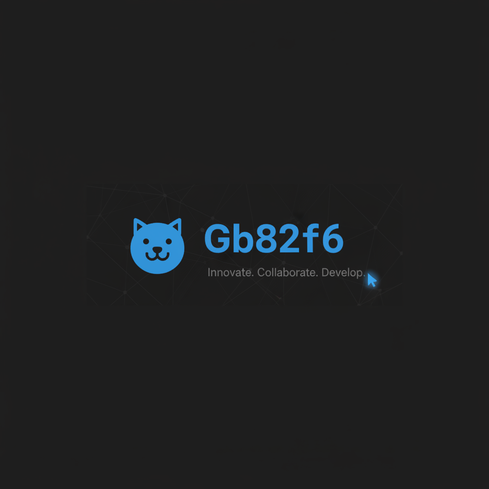
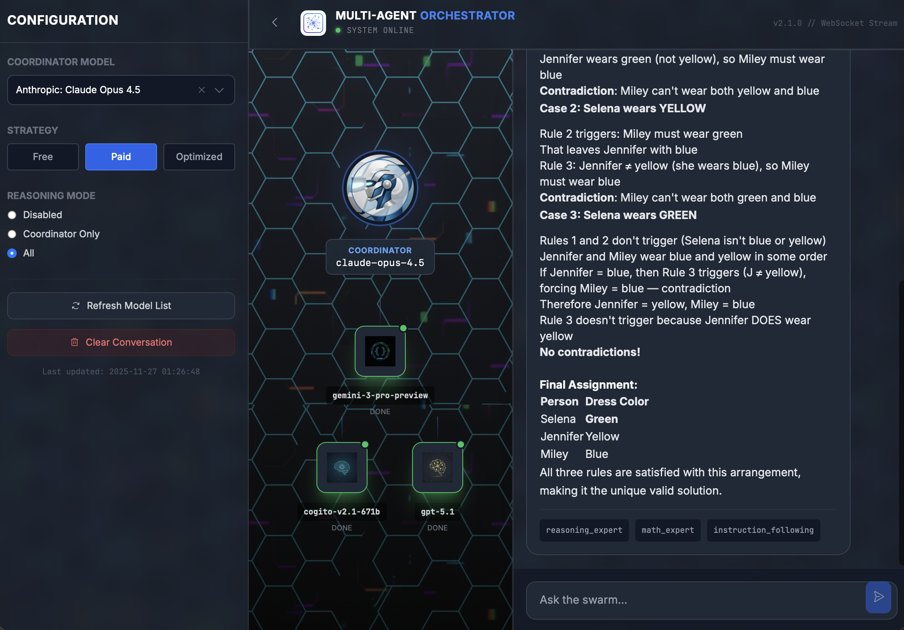
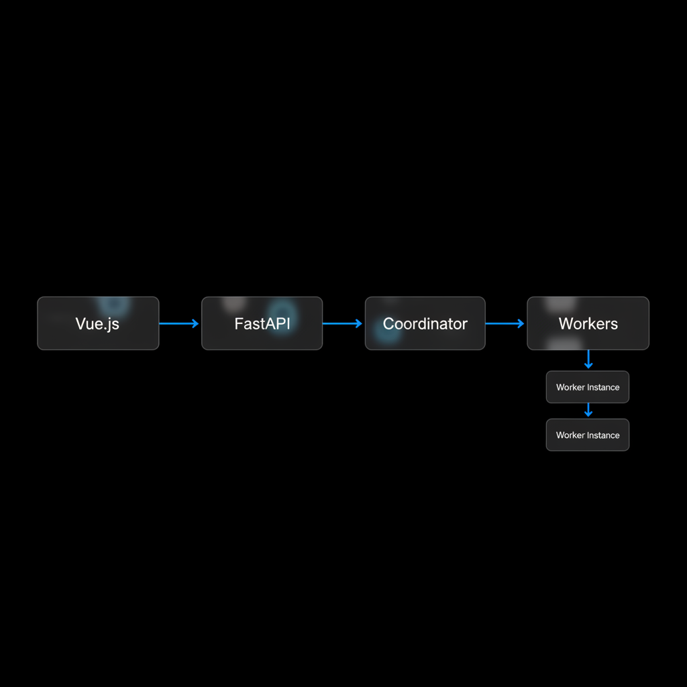

# 🧠 Multi-Agent AI Orchestrator



[](https://opensource.org/licenses/MIT)
[](https://www.python.org/downloads/)
[](https://fastapi.tiangolo.com)
[](https://vuejs.org/)

**Intelligent, Dynamic, and Real-Time AI Orchestration**

## 🌟 About

The Multi-Agent AI Orchestrator is a next-generation system that solves complex problems not by relying on a single AI model, but by distributing the task to a **specialized team of agents**.

This project goes beyond simple routing. It features an **"AI-Powered Intelligence System"** that autonomously analyzes, categorizes, and ranks hundreds of available AI models using advanced agents (like Grok 4.1) to ensure the perfect team is assembled for every query.



## ✨ Key Features

*   **🎭 Dynamic Role Assignment:** Roles such as "Code Expert", "Mathematician", or "Storyteller" are created instantly based on your query.
*   **🚀 Real-Time Visualization:** Watch how the system thinks, which agents it selects, and their working status on a live, animated network graph.
*   **⚡ Event-Driven Architecture:** Built on FastAPI and WebSockets for true real-time interaction and visualization.
*   **🧠 AI-Powered Intelligence:** Automatically analyzes and labels new models using a specialized AI analyst agent.
*   **💾 Smart Caching:** Intelligent local caching for instant startup and minimal API overhead.
*   **🧠 Smart Coordinator:** An intelligent manager that knows which model performs which task better and more cost-effectively.
*   **⚡ Speed & Efficiency:** Uses a single agent for simple queries ("Hello") to save resources, while calling upon the entire fleet for complex projects.
*   **🎨 Modern Interface:** A dark-mode supported, sleek, and user-friendly experience designed to minimize eye strain.

## 🛠️ How It Works



1.  **Analysis:** The Coordinator model understands your query and determines the required skill tags.
2.  **Team Assembly:** Models best suited for the determined tags (OpenAI, Anthropic, Google, Meta, etc.) are selected from the pool.
3.  **Parallel Processing:** Selected agents start working simultaneously. Each solves the problem according to its own area of expertise.
4.  **Synthesis:** Responses from all agents are collected by the Coordinator, conflicts are resolved, and a final, polished answer is generated.

## 🚀 Installation & Usage

Running the project on your local machine is simple.

1.  **Clone the Repository:**
    ```bash
    git clone https://github.com/BTankut/multi_agent_app.git
    cd multi_agent_app
    ```

2.  **Install Requirements:**
    ```bash
    pip install -r requirements.txt
    pip install fastapi uvicorn websockets
    ```

3.  **Set Environment Variables:**
    Copy `.env-example` to `.env` and add your OpenRouter API key.
    ```bash
    OPENROUTER_API_KEY=sk-or-v1-....
    ```

4.  **Run the Application:**
    ```bash
    python run_modern_ui_v2.py
    ```
    Your browser will open automatically.

### 🧠 Updating Model Intelligence

To keep the system smart, you can trigger a fresh analysis of all available models. This uses a high-speed AI agent to re-evaluate every model's capabilities.

```bash
curl -X POST http://127.0.0.1:8000/api/analyze-models
```
*Note: This process runs in the background and may take 5-10 minutes.*

## 📜 License

This project is licensed under the **MIT License**. This means you are free to use, modify, and distribute it. See the `LICENSE` file for details.

---
*Designed & Developed by BTankut*
