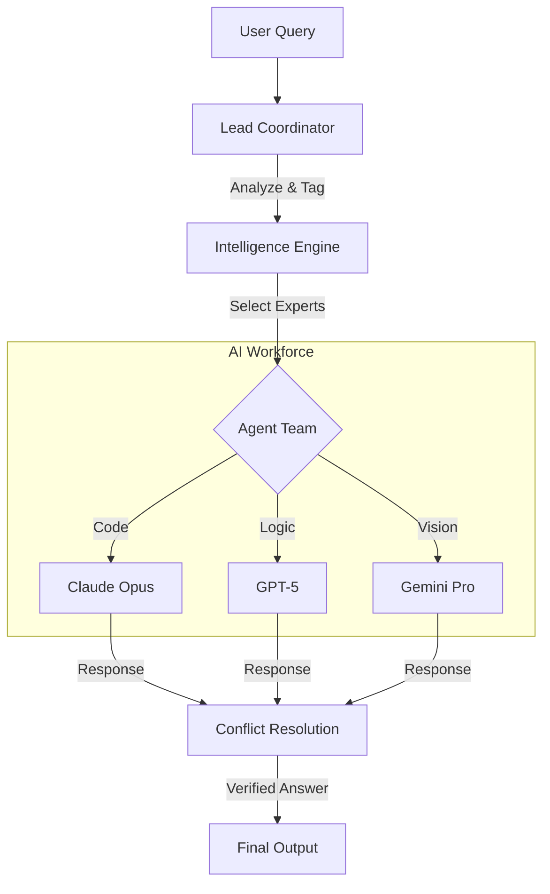

# 🧠 Multi-Agent AI Orchestrator


[](https://opensource.org/licenses/MIT)
[](https://www.python.org/downloads/)
[](https://fastapi.tiangolo.com)
[](https://vuejs.org/)

**Intelligent, Dynamic, and Real-Time AI Orchestration**

## 🌟 About

The Multi-Agent AI Orchestrator is a next-generation system that solves complex problems not by relying on a single AI model, but by distributing the task to a **specialized team of agents**.

This project goes beyond simple routing. It features an **"AI-Powered Intelligence System"** that autonomously analyzes, categorizes, and ranks hundreds of available AI models using advanced agents (like Grok 4.1) to ensure the perfect team is assembled for every query.

## ✨ Key Features

*   **🧠 AI-Powered Model Intelligence:** The system autonomously analyzes 340+ models, determining their capabilities (Math, Code, Vision), quality tiers, and optimal roles.
*   **🎭 Dynamic Role Assignment:** Agents are assigned specialized personas ("Senior Python Architect", "Logical Analyst") based on real-time intelligence data.
*   **🛡️ Cross-Verification:** Critical queries are processed by multiple models from different providers (e.g., 1 OpenAI + 1 Anthropic) to cross-verify facts and eliminate hallucinations.
*   **🚀 Real-Time Visualization:** Watch the orchestration process live via WebSocket streaming—see which agents are picked, when they "think", and how they respond.
*   **⚡ Smart Optimization:** Uses lightweight models for simple queries and reserves flagship models (GPT-5, Claude Opus) for complex reasoning tasks.

## 🛠️ System Architecture



1.  **Analysis:** The Coordinator determines the intent (e.g., "Coding + Math").
2.  **Intelligence Lookup:** The system consults `model_intelligence.json` (generated by Grok) to find the best-in-class models for those specific tags.
3.  **Team Assembly:** A diverse team is formed, enforcing provider diversity (e.g., max 1 OpenAI model) to ensure independent validation.
4.  **Parallel Execution:** Agents work simultaneously in specialized roles.
5.  **Synthesis:** The Coordinator reviews all answers, resolves conflicts, and synthesizes the final verified response.

## 🚀 Installation & Usage

### Prerequisites
- Python 3.10+
- OpenRouter API Key

### Setup

1.  **Clone the Repository:**
    ```bash
    git clone https://github.com/BTankut/multi_agent_app.git
    cd multi_agent_app
    ```

2.  **Environment Setup (macOS/Linux):**
    ```bash
    python3 -m venv venv
    source venv/bin/activate
    pip install -r requirements.txt
    ```

    **Environment Setup (Windows):**
    ```bash
    python -m venv venv
    venv\Scripts\activate
    pip install -r requirements.txt
    ```

3.  **Configuration:**
    Copy `.env-example` to `.env` and add your API key.
    ```bash
    OPENROUTER_API_KEY=sk-or-v1-....
    ```

4.  **Run the Application:**
    ```bash
    # Ensure venv is active
    python run_modern_ui_v2.py
    ```
    Your browser will open automatically at `http://127.0.0.1:8000`.

### 🧠 Updating Model Intelligence

To keep the system smart, you can trigger a fresh analysis of all available models. This uses a high-speed AI agent to re-evaluate every model's capabilities.

```bash
curl -X POST http://127.0.0.1:8000/api/analyze-models
```
*Note: This process runs in the background and may take 5-10 minutes.*

## 📜 License

This project is licensed under the **MIT License**. This means you are free to use, modify, and distribute it. See the `LICENSE` file for details.

---
*Designed & Developed by BTankut*
